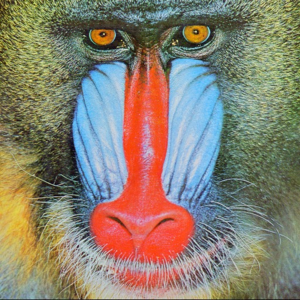
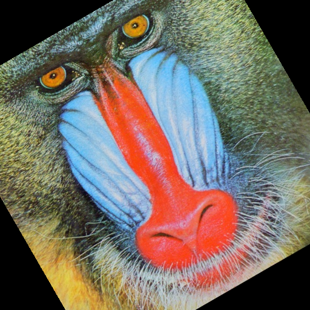
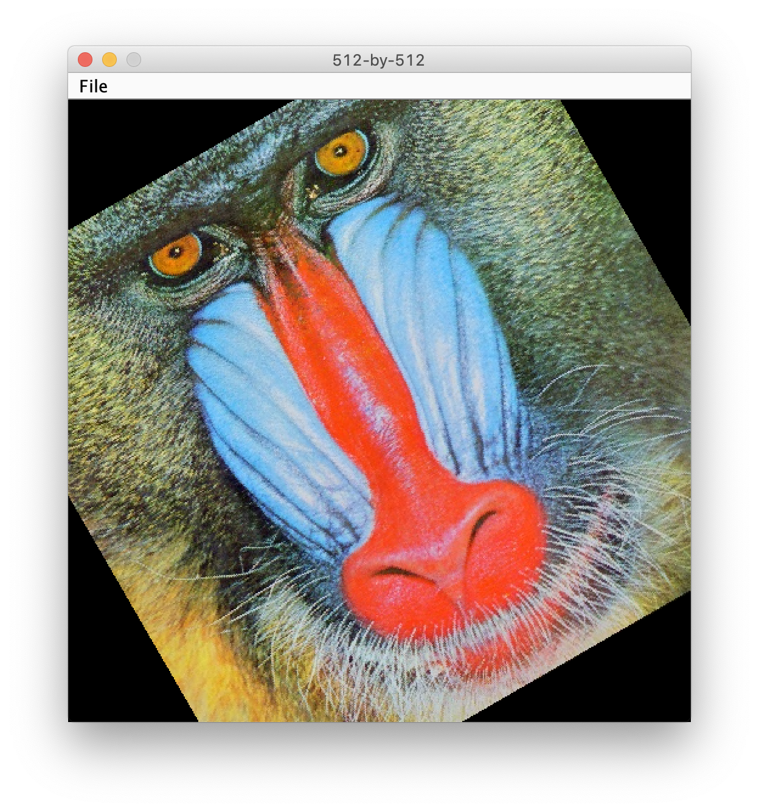
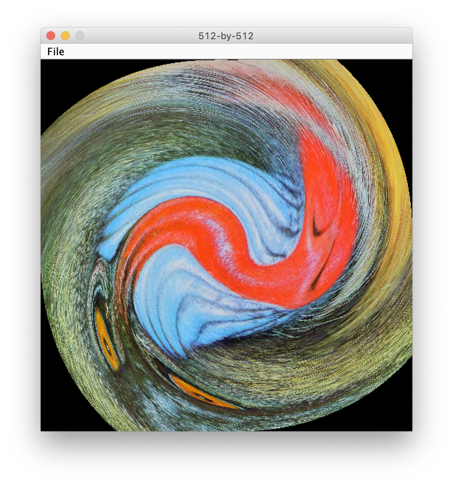
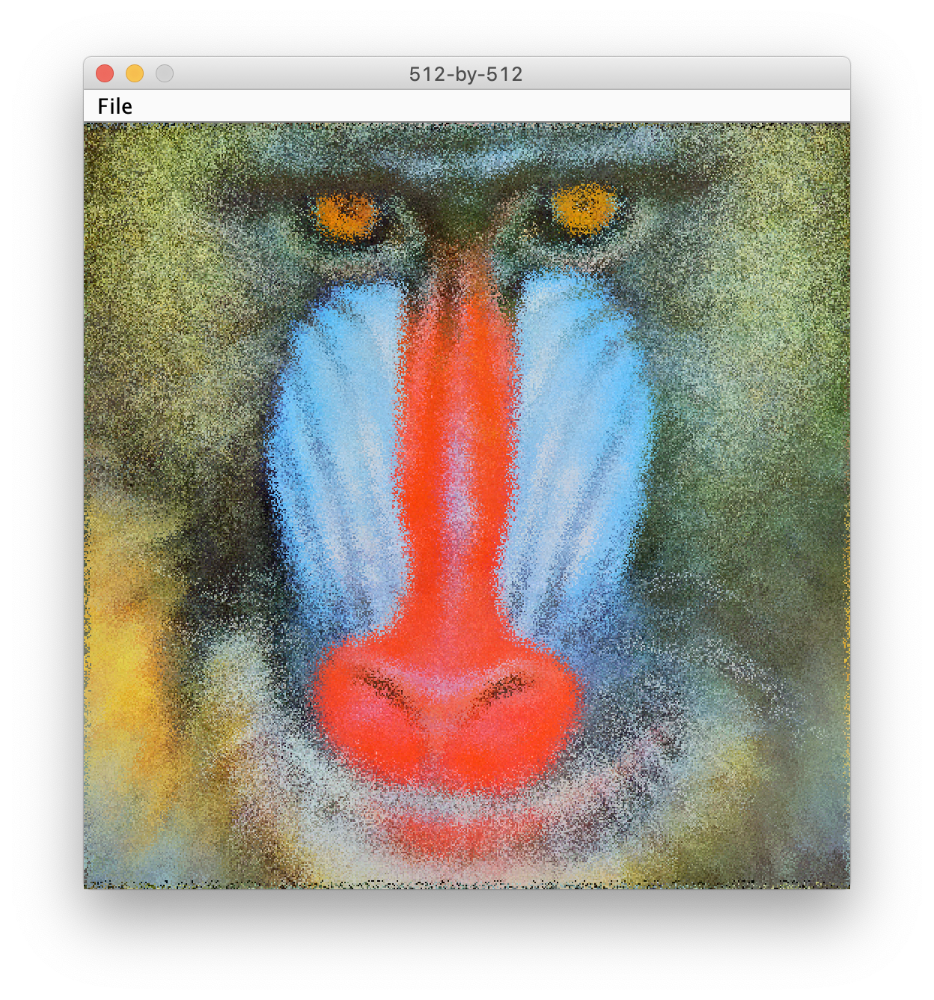
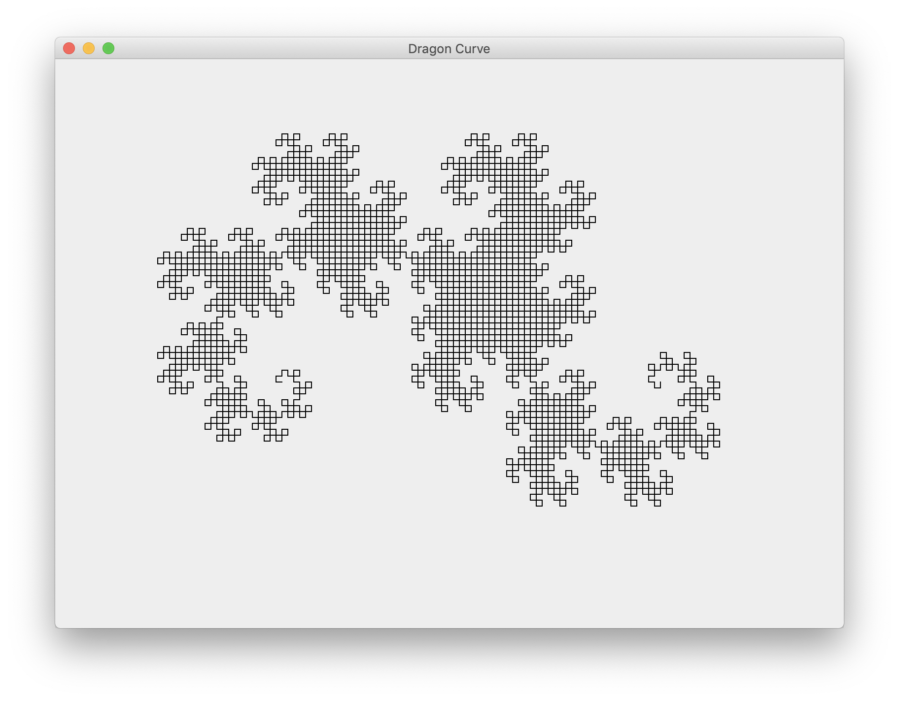
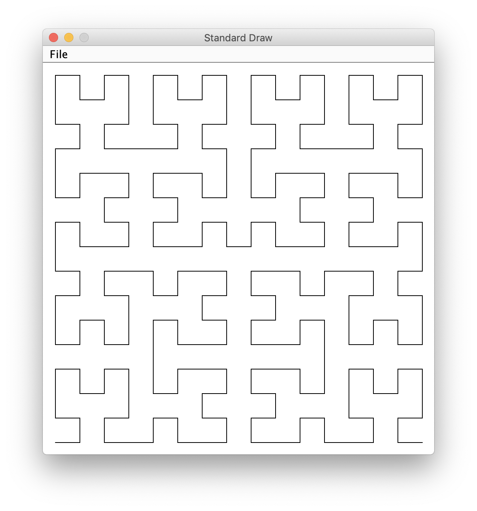
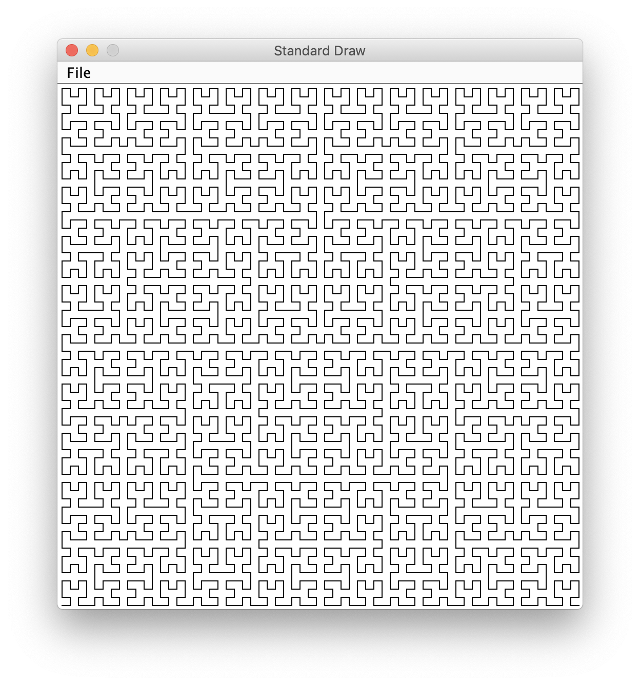

## Java2 HW1
20190303
##### 11510365 XueYiheng
----

#### 1. Rotation Filter
The source picture is



```java
package HW1;

import javax.imageio.ImageIO;
import java.awt.*;
import java.awt.image.BufferedImage;
import java.io.File;
import java.io.IOException;

public class Rotation_Filter1 {

    public static BufferedImage rotateImage(final BufferedImage bufferedimage,
                                            final int degree) {
        int w = bufferedimage.getWidth();
        int h = bufferedimage.getHeight();
        int type = bufferedimage.getColorModel().getTransparency();
        BufferedImage img;
        Graphics2D graphics2d;
        (graphics2d = (img = new BufferedImage(w, h, type))
                .createGraphics()).setRenderingHint(
                RenderingHints.KEY_INTERPOLATION,
                RenderingHints.VALUE_INTERPOLATION_BILINEAR);
        graphics2d.rotate(Math.toRadians(-degree), w / 2, h / 2);
        graphics2d.drawImage(bufferedimage, 0, 0, null);
        graphics2d.dispose();
        return img;
    }

    public static void main(String[] args) throws IOException {
        File f = new File("src/HW1/mandrill.png");
        BufferedImage bi = ImageIO.read(f);
        BufferedImage results = rotateImage(bi,30);
        ImageIO.write(results,"png",new File("/Users/xueyiheng/Desktop/30_cat.png"));
    }
}
```
This is the first method I have used, I use the `BufferedImage` and `graphics2d` from internet, if you want to import the data, just modify the file path at last line. The results is



I have refer to the text book, and read `Scale.java` as below
```java
public class Scale {
    public static void main(String[] args){
        int w = Integer.parseInt(args[1]);
        int h = Integer.parseInt(args[2]);

        Picture source = new Picture(args[0]);
        Picture target = new Picture(w, h);
        for(int colT = 0; colT < w; colT++){
            for(int rowT = 0; rowT<h; rowT++){
                int colS = colT * source.width()/w;
                int rowS = rowT * source.height()/h;
                target.set(colT, rowT, source.get(colS, rowS));
            }
        }
        source.show();
        target.show();
    }
}
```
There are some important ideas I have learnt. It focus on how to change the width and height of each pixel, I think I can use this method to solve my problems. And I write this code as below.

```java
package HW1;

public class Rotation_Filter {

//        colT = (float)((colS - ceni)*Math.sin(degree*Math.PI/180) - (rowS - cenj)*Math.sin(degree*Math.PI/180)+ceni);
//        rowT = (float)((colS - ceni)*Math.cos(degree*Math.PI/180) - (rowS - cenj)*Math.cos(degree*Math.PI/180)+ceni);
    
    public static void main(String[] args) {
        Picture source = new Picture("mandrill.png");
        int w  = source.width();
        int h = source.height();
        double cenI = 0.5 * (w  - 1);
        double cenJ = 0.5 * (h - 1);
        double angle = Math.toRadians(Double.parseDouble("30"));

        int colS;
        int rowS;

        Picture target = new Picture(w, h);

        for (int colT = 0; colT < w; colT++) {
            for (int rowT = 0; rowT < h; rowT++) {
                colS = (int) ((colT - cenI) * Math.cos(angle) - (rowT - cenJ) * Math.sin(angle) + cenI);
                rowS = (int) ((colT - cenI) * Math.sin(angle) + (rowT - cenJ) * Math.cos(angle) + cenJ);

                if (colS >= 0 && colS < w && rowS >= 0 && rowS < h) {
                    target.set(colT, rowT, source.get(colS, rowS));
                }
            }
        }
        source.show();
        target.show();
    }
}
```
`col` means `column` and `row` means `row`, the last letter is `S` means `source` and `T` means `target`. I try to use sin & cos functions to do some changes between source and target. The result is



#### 2. Swirl Filter
I also use the parameters and methods like the first one.

```java
package HW1;

public class Swirl_Filter {
    public static void main(String[] args) {
        Picture source = new Picture("mandrill.png");
        int w  = source.width();
        int h = source.height();
        
        double colCenter = 0.5 * (w  - 1);
        double rowCenter = 0.5 * (h - 1);

        Picture target = new Picture(w, h);

        for (int colT = 0; colT < w; colT++) {
            for (int rowT = 0; rowT < h; rowT++) {
                double distanceCol = colT - colCenter;
                double distanceRow = rowT - rowCenter;
                double r = Math.sqrt(distanceCol*distanceCol + distanceRow*distanceRow);
                double angle = Math.PI / 256 * r;
                int colS = (int) (+distanceCol * Math.cos(angle) - distanceRow * Math.sin(angle) + colCenter);
                int rowS = (int) (+distanceCol * Math.sin(angle) + distanceRow * Math.cos(angle) + rowCenter);

                if (colS >= 0 && colS < w && rowS >= 0 && rowS < h)
                    target.set(colT, rowT, source.get(colS, rowS));
            }
        }
        source.show();
        target.show();
    }
}
```
The result is


#### 3. Glass Filter
```java
package HW1;

import java.awt.*;

public class Glass_Filter {
    public static void main(String[] args) {
        Picture source = new Picture("mandrill.png");
        int w  = source.width();
        int h = source.height();
        Picture target = new Picture(w, h);

        for (int colT = 0; colT < w; colT++) {
            for (int rowT = 0; rowT < h; rowT++) {
                int colS = (w  + colT + random(-5, 5)) % w;
                int rowS = (h + rowT + random(-5, 5)) % h;
                Color color = source.get(colS, rowS);
                target.set(colT, rowT, color);
            }
        }
        source.show();
        target.show();
    }

    public static int random(int a, int b) {
        return a + StdRandom.uniform(b-a+1);
    }
}
```
In this one, I have used a standard package named `StdRandom`, and the result is


#### 4. Dragon Curve
```java
package HW1;

import javax.swing.*;
import java.awt.*;
import java.util.ArrayList;
import java.util.Collections;
import java.util.List;

public class DragonCurve extends JFrame {

    private List<Integer> turns;
    private double startingAngle, side;

    public DragonCurve(int iter) {
        super("Dragon Curve");
        setBounds(100, 100, 800, 600);
        setDefaultCloseOperation(EXIT_ON_CLOSE);
        turns = getSequence(iter);
        startingAngle = -iter * (Math.PI / 4);
        side = 400 / Math.pow(2, iter / 2.);
    }

    public List<Integer> getSequence(int iterations) {
        List<Integer> turnSequence = new ArrayList<Integer>();
        for (int i = 0; i < iterations; i++) {
            List<Integer> copy = new ArrayList<Integer>(turnSequence);
            Collections.reverse(copy);
            turnSequence.add(1);
            for (Integer turn : copy) {
                turnSequence.add(-turn);
            }
        }
        return turnSequence;
    }

    @Override
    public void paint(Graphics g) {
        g.setColor(Color.BLACK);
        double angle = startingAngle;
        int x1 = 230, y1 = 350;
        int x2 = x1 + (int) (Math.cos(angle) * side);
        int y2 = y1 + (int) (Math.sin(angle) * side);
        g.drawLine(x1, y1, x2, y2);
        x1 = x2;
        y1 = y2;
        for (Integer turn : turns) {
            angle += turn * (Math.PI / 2);
            x2 = x1 + (int) (Math.cos(angle) * side);
            y2 = y1 + (int) (Math.sin(angle) * side);
            g.drawLine(x1, y1, x2, y2);
            x1 = x2;
            y1 = y2;
        }
    }

    public static void main(String[] args) {
        new DragonCurve(12).setVisible(true);
    }
}
```
This is 12th dragon curve, you can change the `12` to `arg[0]` at the last line to input some arguments.


#### 5. Hilbert
```java
package HW1;
import Lab2.StdDraw;
import java.awt.*;

public class Turtle {
    private double x, y;     // turtle is at (x, y)
    private double angle;    // facing this many degrees counterclockwise from the x-axis

    public Turtle(double x0, double y0, double a0) {
        x = x0;
        y = y0;
        angle = a0;
    }

    public void turnLeft(double delta) {
        angle += delta;
    }

    public void goForward(double step) {
        double oldx = x;
        double oldy = y;
        x += step * Math.cos(Math.toRadians(angle));
        y += step * Math.sin(Math.toRadians(angle));
        StdDraw.line(oldx, oldy, x, y);
    }

    public void show() {
        StdDraw.show();
    }

    public void pause(int t) {
        StdDraw.pause(t);
    }


    public void setPenColor(Color color) {
        StdDraw.setPenColor(color);
    }

    public void setPenRadius(double radius) {
        StdDraw.setPenRadius(radius);
    }

    public void setCanvasSize(int width, int height) {
        StdDraw.setCanvasSize(width, height);
    }

    public void setXscale(double min, double max) {
        StdDraw.setXscale(min, max);
    }

    public void setYscale(double min, double max) {
        StdDraw.setYscale(min, max);
    }

    public static void main(String[] args) {
        StdDraw.enableDoubleBuffering();
        double x0 = 0.5;
        double y0 = 0.0;
        double a0 = 60.0;
        double step = Math.sqrt(3)/2;
        Turtle turtle = new Turtle(x0, y0, a0);
        turtle.goForward(step);
        turtle.turnLeft(120.0);
        turtle.goForward(step);
        turtle.turnLeft(120.0);
        turtle.goForward(step);
        turtle.turnLeft(120.0);
    }
}
public class Hilbert {
    private Turtle turtle;
    public Hilbert(int n) {
        turtle = new Turtle(0.5, 0.5, 0.0);
        double max = Math.pow(2, n);
        turtle.setXscale(0, max);
        turtle.setYscale(0, max);
        hilbert(n);
    }

    private void hilbert(int n) {
        if (n == 0) return;
        turtle.turnLeft(90);
        treblih(n-1);
        turtle.goForward(1.0);
        turtle.turnLeft(-90);
        hilbert(n-1);
        turtle.goForward(1.0);
        hilbert(n-1);
        turtle.turnLeft(-90);
        turtle.goForward(1.0);
        treblih(n-1);
        turtle.turnLeft(90);
    }

    public void treblih(int n) {
        if (n == 0) return;
        turtle.turnLeft(-90);
        hilbert(n-1);
        turtle.goForward(1.0);
        turtle.turnLeft(90);
        treblih(n-1);
        turtle.goForward(1.0);
        treblih(n-1);
        turtle.turnLeft(90);
        turtle.goForward(1.0);
        hilbert(n-1);
        turtle.turnLeft(-90);
    }

    public static void main(String[] args) {
        int n = Integer.parseInt("6");
        new Hilbert(n);
    }
    // This part of the code reference the Princeton's official website
}
```


Show the 4th and 6th hilbert lines as below.



