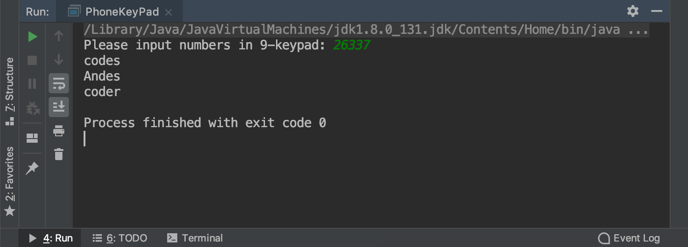
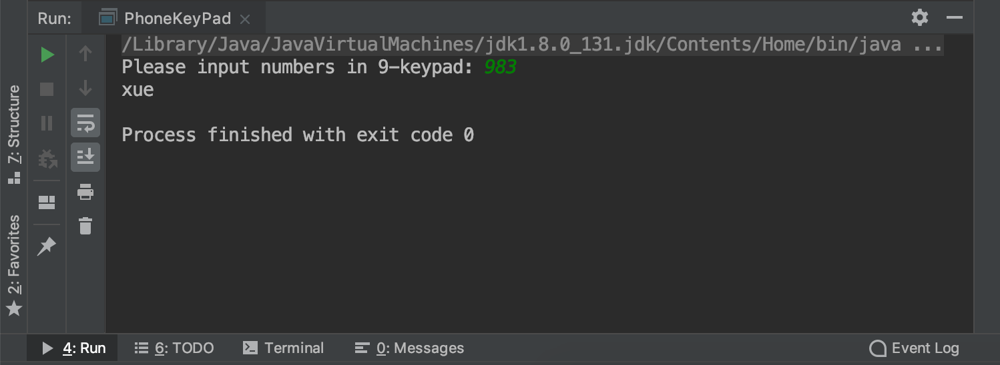

## Java2 HW2
20190310
##### 11510365 XueYiheng
----

```java
public static int getNumber(char upperCaseLetter){
        if(upperCaseLetter == 'A' || upperCaseLetter =='B'|| upperCaseLetter == 'C')
            return 2;
        else if(upperCaseLetter == 'D' || upperCaseLetter =='E' || upperCaseLetter == 'F')
            return 3;
        else if(upperCaseLetter == 'G' || upperCaseLetter =='H' || upperCaseLetter == 'I')
            return 4;
        else if(upperCaseLetter == 'J' || upperCaseLetter== 'K' || upperCaseLetter == 'L')
            return 5;
        else if(upperCaseLetter == 'M' || upperCaseLetter =='N' || upperCaseLetter == 'O')
            return 6;
        else if(upperCaseLetter == 'P' || upperCaseLetter =='Q' || upperCaseLetter == 'R'||upperCaseLetter == 'S')
            return 7;
        else if( upperCaseLetter =='T' || upperCaseLetter == 'U'||upperCaseLetter == 'V' )
            return 8;
        else if( upperCaseLetter =='W' ||upperCaseLetter =='X'|| upperCaseLetter == 'Y' || upperCaseLetter == 'Z')
            return 9;
        else
            return 0;
    }
```

First, use the function `getNumber` to set the letters to the numbers.

```java
public static void main(String[] args){
        String phNumber = "";
        String output = "";
        HashMap<String, String> map = new HashMap<>();
        try{
            Scanner source = new Scanner(new File("/Users/xueyiheng/Desktop/input.txt"));
            while(source.hasNext()){
                phNumber = source.next();
                output = "";
                for(int i = 0 ; i < phNumber.length() ; i++){
                    char character = Character.toUpperCase(phNumber.charAt(i));
                    if(Character.isLetter(character)){
                        int num = getNumber(character);
                        output = output + num;
                    }
                    else{
                        output = output + character;
                    }
                }
                map.put(phNumber, output);}
            Scanner userInput=new Scanner(System.in);
            System.out.print("Please input numbers in 9-keypad: ");
            String str=userInput.next();
            int flag=0;
            for (HashMap.Entry<String,String> entry : map.entrySet()) {
                if(str.equalsIgnoreCase(entry.getValue())){
                    System.out.println(entry.getKey());
                    flag=1;
                }
            }
            if(flag==0) System.out.println("No matchings found");
        }catch(Exception e){System.out.println("Input file is missing");}
    }
    # This code refers to chegg website.
```
There are some names saved in `input.txt` file.

```
Andes
coder
codes
cao
zhen
qi
xue
yi
heng
```
And we can test the input and output as below.



