### Java2 - JavaFX Document
**11510365 Yiheng Xue**
1h+0.5h+4h+2.5h+3.5h+4h+2h+1h+1h
==Total = 19.5h==

#### 1. HelloWorldFX
This section introduces some basic ideas of JavaFX and this is a simple GUI application. There are 3 buttons and a screen to show the text.
几乎所有的东西都需要import
```java
import javafx.application.Application;
import javafx.scene.Scene;
import javafx.stage.Stage;
import javafx.application.Platform;
import javafx.scene.layout.BorderPane;
import javafx.scene.layout.HBox;
import javafx.geometry.Pos;
import javafx.scene.control.Label;
import javafx.scene.control.Button;
import javafx.scene.text.Font;
```
Therefore we could use
```java
import javafx.*
```
Stage, scene and sceneGraph are very important for every JavaFX app. 每一个都需要设置title，尺寸信息等参数，都是面向对象的过程。layout也是可以设置的。
The lambda expression
```java
e -> message.setText("Hello World!")
```
setOnAction() method as below
```java
helloButton.setOnAction( e -> message.setText("Hello World!") );
```

#### 2. CSS Style
```java
Color myColor = Color.color( r, g, b, a );
```
对于颜色可以用RGB三个参数进行设定，这个里面有个参数a，应该是饱和度或者透明度，在0-1之间取之，一般也默认为1，rgb三个数字的值域在0-255.

```java
Font myFont = Font.font( family, weight, posture, size );
```
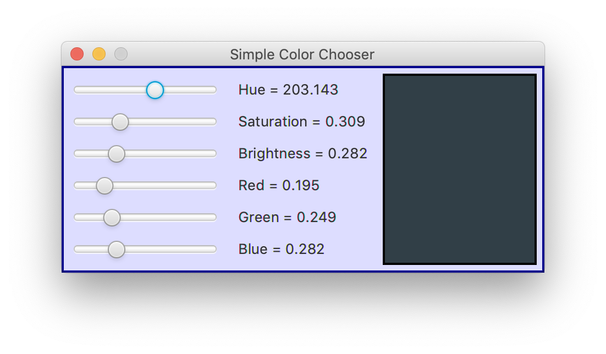
在`SimpleColorChooser.java`中，HSB和RGB六个参数可以改变颜色

```java
color = Color.hsb(hueSlider.getValue(), saturationSlider.getValue(), brightnessSlider.getValue());
```
通过设置参数，getValue获取之后得到新的颜色并展示。
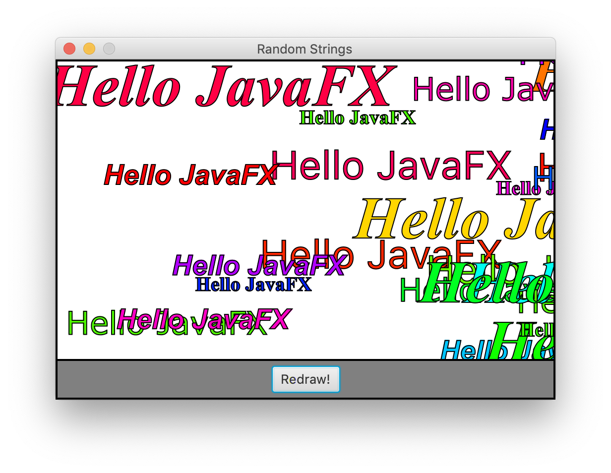
在`RandonStrings.java`中
```java
font1 = Font.font("Times New Roman", FontWeight.BOLD, 20);
font2 = Font.font("Arial", FontWeight.BOLD, FontPosture.ITALIC, 28);
font3 = Font.font("Verdana", 32);
font4 = Font.font(40);
font5 = Font.font("Times New Roman", FontWeight.BOLD, FontPosture.ITALIC, 60);
```
设置好了不同的字体，包括字体、粗细、大小等信息。
```java
canvas = new Canvas(500,300);
```
设置了目标框的尺寸。
之后的`setStyle`设置了颜色，通过调用`draw()`这个方法来画图。后面通过switch进行随机取样操作。

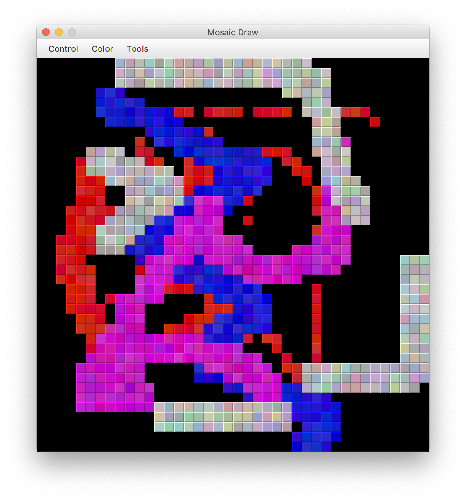
在`MosaicDraw.java`中，可以获得鼠标位置信息，通过设定的颜色和尺寸进行绘图。
其中的`createMenuBar()`设置界面选项信息，eraseSquare & paintSquare两个方法分别是绘图和擦除。
```java
int row = mosaic.yCoordToRowNumber((int)evt.getY());
int col = mosaic.xCoordToColumnNumber((int)evt.getX());
```
来获取鼠标信息。
这个绘图的app可以获取鼠标信息是非常有趣的，鼠标信息的坐标位置匹配到预设的画笔信息，包括尺寸、颜色，是paint还是earser等信息。
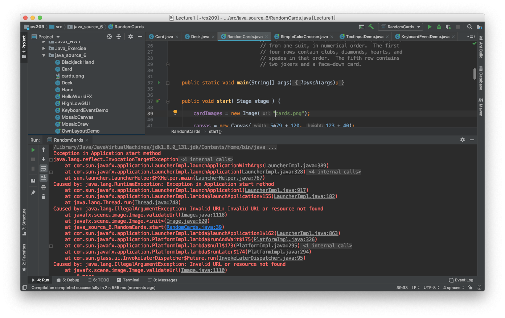
In `RandomCard.java`, this is the most interesting code in this part. There is a mistake because I move the code into `src/java_source_6`, therefore I need to modify the url as below
```java
// cardImages = new Image("cards.png");
cardImages = new Image("java_source_6/cards.png");
```
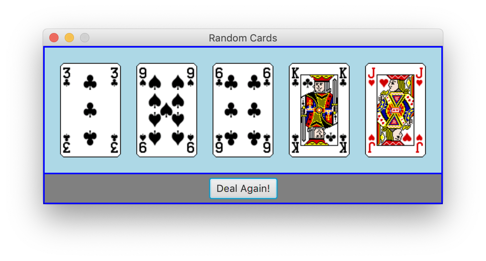
```
3 of Clubs
9 of Spades
6 of Clubs
King of Clubs
Jack of Hearts
```
会输出图片并且识别出扑克牌的信息，这是因为在`Caed.java`中
```java
cardImages = new Image("cards.png");
```
Import the figure first.
```java
public String getValueAsString() {
        if (suit == JOKER)
            return "" + value;
        else {
            switch ( value ) {
            case 1:   return "Ace";
            case 2:   return "2";
            case 3:   return "3";
            case 4:   return "4";
            case 5:   return "5";
            case 6:   return "6";
            case 7:   return "7";
            case 8:   return "8";
            case 9:   return "9";
            case 10:  return "10";
            case 11:  return "Jack";
            case 12:  return "Queen";
            default:  return "King";
            }
        }
    }
```
就已经划分出来每个信息在图中的位置，指定了数字以及花色。

在css中，需要指定字体的多种信息如下
```
message.setStyle("-fx-padding: 5px; -fx-border-color: black; -fx-border-width: 1px" );
-fx-font: 30pt "Times New Roman";
-fx-font: bold italic 18pt serif;
-fx-font: bold 42pt monospace;
```

Label and Button
```
Button {
   -fx-font: bold 16pt "Times New Roman";
   -fx-text-fill: darkblue;
}

Label {
   -fx-font: 15pt sans-serif;
   -fx-padding: 7px;
   -fx-border-color: darkred;
   -fx-border-width: 2px;
   -fx-text-fill: darkred;
   -fx-background-color: pink;
}
```
You can then apply the style to all components in a scene with the statement
```
scene.getStylesheets().add("mystyle.css");
```

#### Events
event包括鼠标位置、鼠标click、鼠标的拖拽和键盘等信息，还会包括外部传感器但是目前部设计。
在`HelloWorldFC.java`中，
```java
helloButton.setOnAction( e -> message.setText("Hello World!") );
```
可以获取按键信息。
```java
canvas.setOnMousePressed( evt -> redraw() );
```
Could get the mouse 的位置信息。
Dragging可以理解为拖拽，在马赛克画图那部分中，点按住鼠标左键并且移动，就可以画出图案。
```java
public void mouseDragged(MouseEvent evt) {
    if ( dragging == false )  // First, check if we are 
        return;               //   processing a dragging gesture.
    int x = evt.getX(); // Current position of Mouse.
    int y = evt.getY();
      .  
      .  // Process a mouse movement from (prevX, prevY) to (x,y).
      .
    prevX = x;  // Remember the current position for the next call.
    prevY = y;
}
```
传递信息
```java
c.setOnMousePressed( e -> mousePressed(e) );
c.setOnMouseDragged( e -> mouseDragged(e) );
c.setOnMouseReleased( e -> mouseReleased(e) );
```

#### Basic Controls
This lecture is about interface between human and pc, just like a slider is easy for us to input the data.
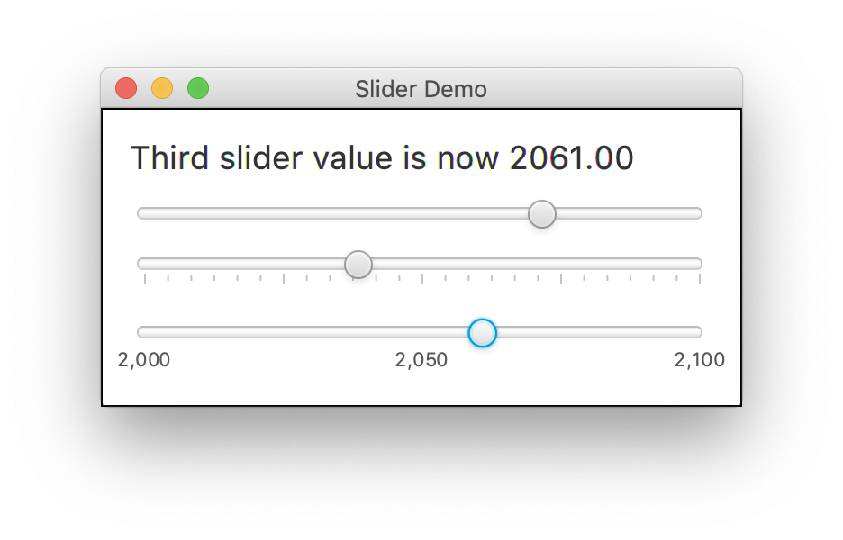
在`SliderDemo.java`中，三个滑动键可以输入不同的数字，可以应用在之前的RGB、HSB调色中。
```java
private Slider slider1, slider2, slider3;
```
There are 3 sliders in this project.
```java
slider1 = new Slider(0, 10, 5);
slider2 = new Slider();
// default values is(0, 100, 0), these 3 value means min, max and value.
```
The imageView as below
```java
Image tux = new Image("icons/tux.png");
ImageView tuxIcon = new ImageView( tux );
```
Set background's color as below
```java
c.setBackground(new Background(new BackgroundFill(Color.WHITE,null,null)));
// This is in the package javafx.scene.layout.
```
About label and button, 需要定义按键和标签的颜色、文字以及触发的动作指令
```java
Label message = new Label("Hello World");
Label linuxAd = new Label("Choose Linux First!", tuxIcon);
```
Assuming that `tuxIcon` is the imageView object from the previous subsection.
The Button like a label, 像label一样显示信息如下所示
```java
Button stopButton = new Button("Stop");
Button linuxButton = new Button("Get Linux", tuxIcon);
```
但是需要增加的一点是触发的指令
```
stopButton.setOnAction( e -> animator.stop());
```
We could set up a group of ration buttons that can be used to select a color as below
```java
RadioButton redRadio, blueRadio, greenRadio, yellowRadio;
         // Variables to represent the radio buttons.
         // These might be instance variables, so that
         // they can be used throughout the program.
ToggleGroup colorGroup = new ToggleGroup();
redRadio = new RadioButton("Red");   // Create a button.
redRadio.setToggleGroup(colorGroup); // Add it to the ToggleGroup.
blueRadio = new RadioButton("Blue");
blueRadio.setToggleGroup(colorGroup);
greenRadio = new RadioButton("Green");
greenRadio.setToggleGroup(colorGroup);
yellowRadio = new RadioButton("Yellow");
yellowRadio.setToggleGroup(colorGroup);
redRadio.setSelected(true);  // Make an initial selection.
```
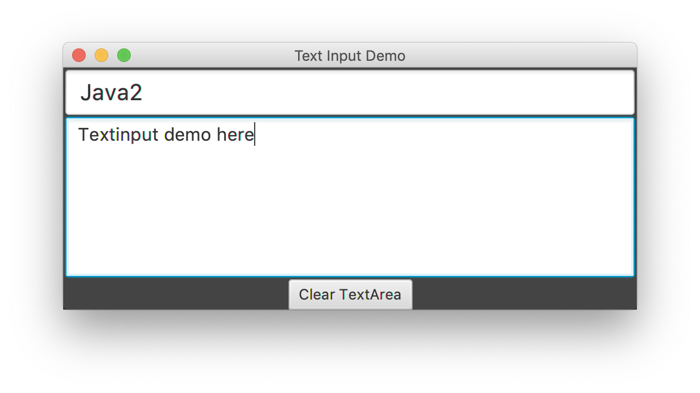
In `TextInputDemo.java` we could input the text as the saved font and size at different areas.
```java
titleInput = new TextField(title);
titleInput.setFont( Font.font(null, FontWeight.BOLD, 20) );
titleInput.setPrefColumnCount(20);
        
contentInput = new TextArea();
contentInput.setText(content);
contentInput.setFont( Font.font(16) );
contentInput.setPrefRowCount(6);
contentInput.setPrefColumnCount(30);
```
首先定义了`title`和`content`两个string的变量，然后对位置和尺寸进行设定。

#### Layout
在一个可视化界面中，布局是可以自己设定参数的。
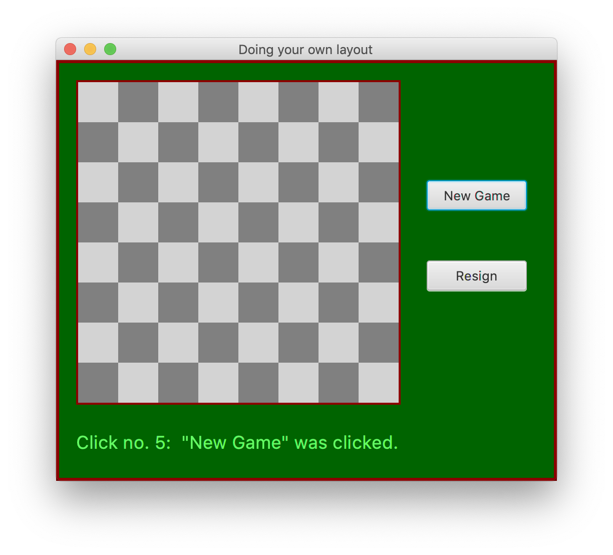
In `OwnLayoutDemo.java`, this is a game layout, we could set up the buttons and the main page.

#### Program
这个游戏设计到了event的处理，和之前的扑克牌的获取方式一样，在png图片中指定位置取出扑克牌的图案并且命名。
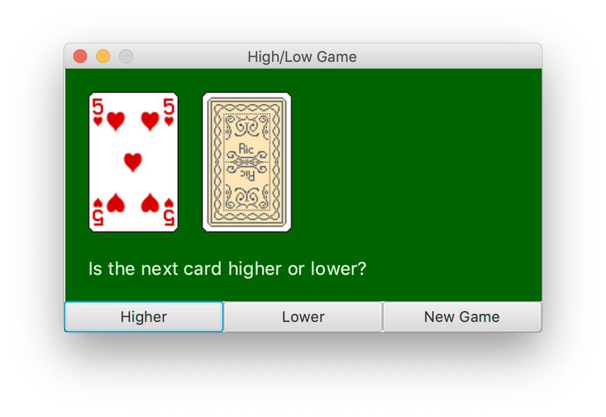

#### Exercise

##### Exercise1. 
这个需要先建立两个对象，设定颜色和形状，需要获取鼠标拖拽信息，根据提供的代码。
Fill the canvas with white
```java
Canvas canvas = new Canvas(500,380);
canvasGraphics = canvas.getGraphicsContext2D();
canvasGraphics.setFill(Color.WHITE);
canvasGraphics.fillRect(0,0,500,380);
canvasGraphics.setStroke(Color.BLACK); // stroke color never changes
```
在mouseDragged的方法中，需要判断是否dragging，否则不能进行操作。
```java
if( evt.isShiftDown())
```
通过这个判断是否按下shift键，给定不同的颜色和形状。
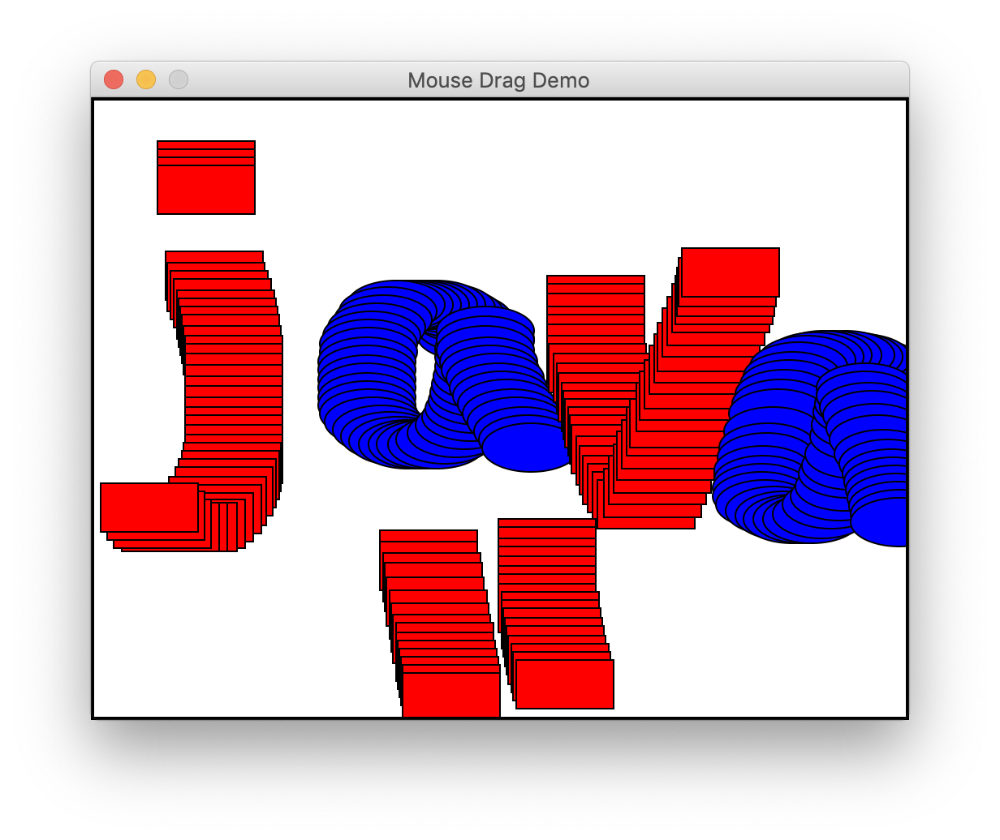

##### Exercise2.
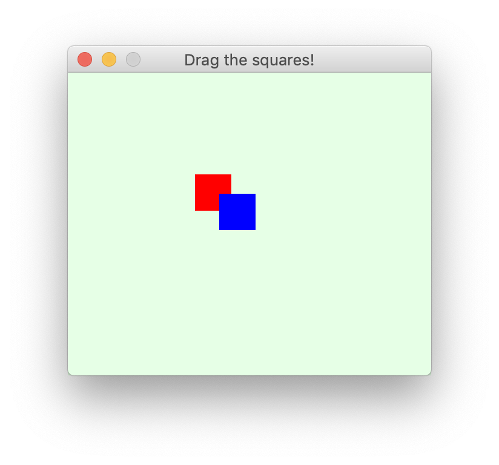
```java
public void mouseDragged(MouseEvent evt) { 
    if (dragging == false)  
      return;
    double x = evt.getX();  // Get mouse position.
    double y = evt.getY();
    if (dragRedSquare) {  // Move the red square.
       x1 = x;  // Put top-left corner at mouse position.
       y1 = y;
    }
    else {   // Move the blue square.
       x2 = x;  // Put top-left corner at mouse position.
       y2 = y;
    }
    draw();  // redraw canvas with square in new location
}
```
先判断是否dragging，然后获取鼠标位置，如果移动某一个颜色的方块，这个方块的位置信息就会更新。然后再次draw出来。

##### Exercise3.
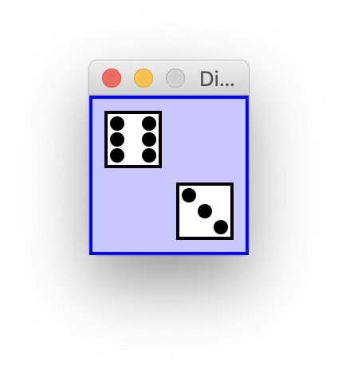
这个里面有一个画图的函数，可以画出来骰子的图案，mark一下。

##### Exercise4.
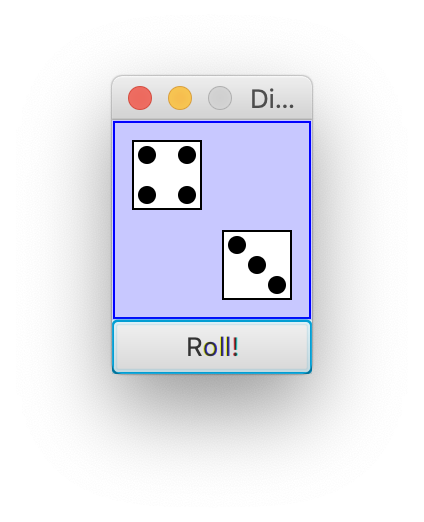
多了一个button，需要通过random来进行取值。

##### Exercise5.
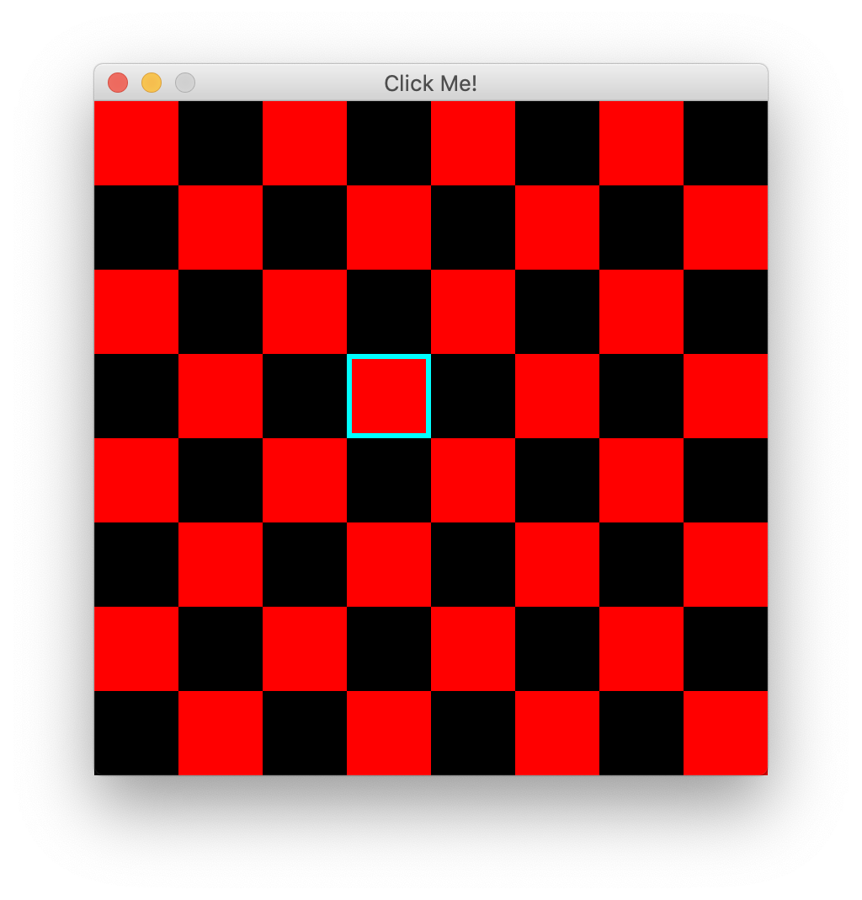
```java
if (selectedRow >= 0) {
        // Since there is a selected square, draw a cyan
        // border around it.  (If selectedRow < 0, then
        // no square is selected and no border is drawn.)
    g.setStroke(Color.CYAN);
    g.setLineWidth(3);  // the border will be 3 pixels wide
    y = selectedRow * 50;  // y-coord of top-left corner of selected square
    x = selectedCol * 50;  // x-coord of top-left corner of selected square
    g.strokeRect(x+1.5, y+1.5, 47, 47);
}
```
The checkerboard has been drawn.

##### Exercise6.
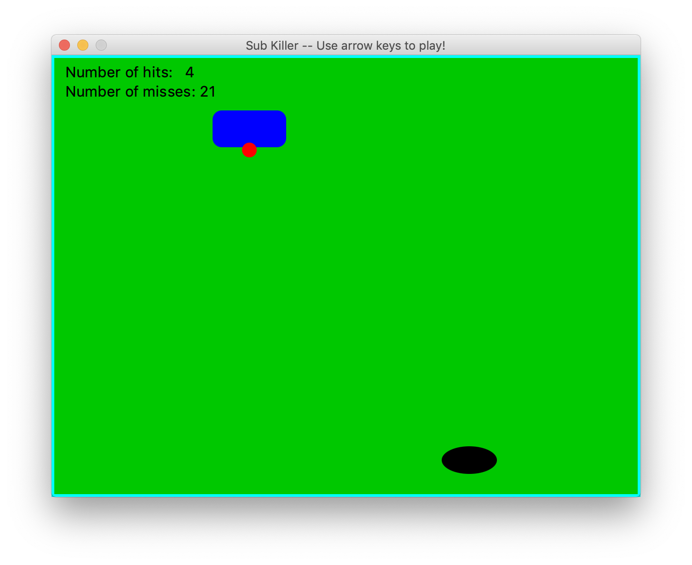

##### Exercise7.
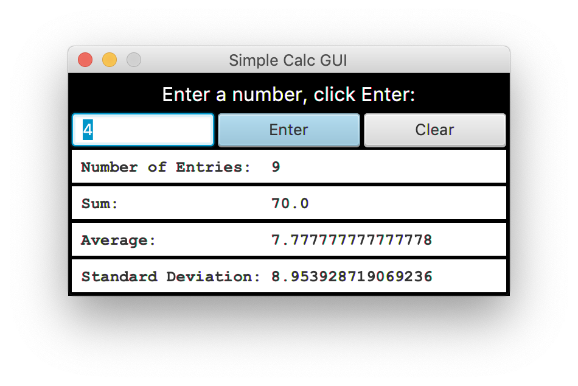

##### Exercise8.
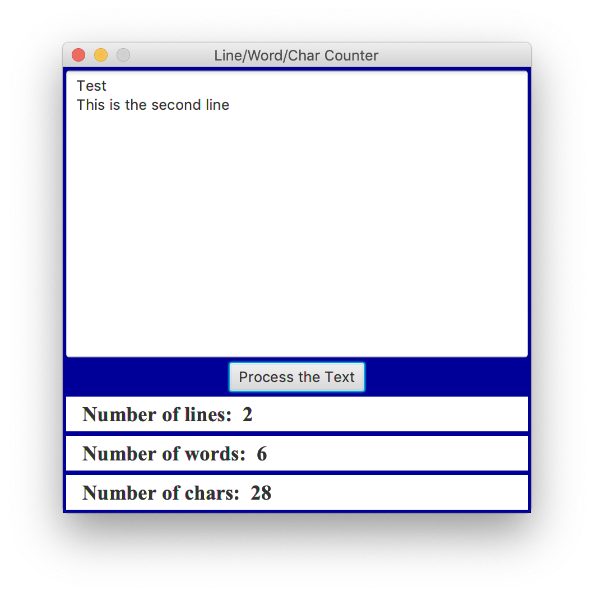

##### Exercise9.
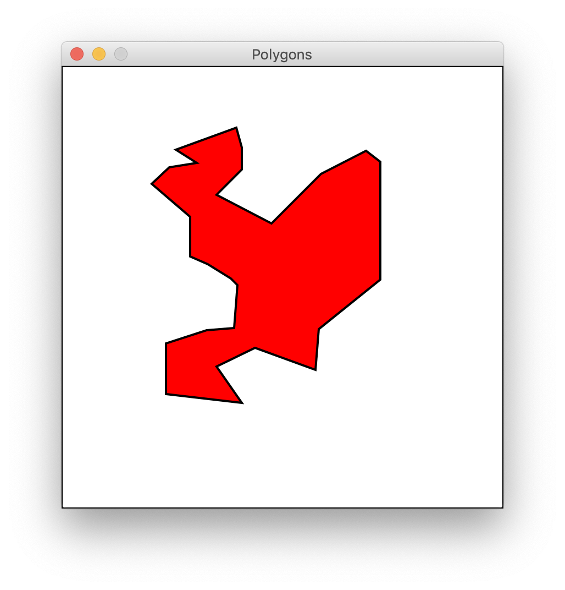

##### Exercise10.
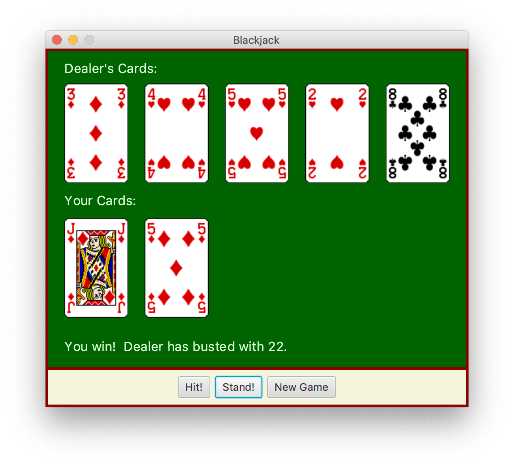
这个游戏的规则很复杂

##### Exercise11.
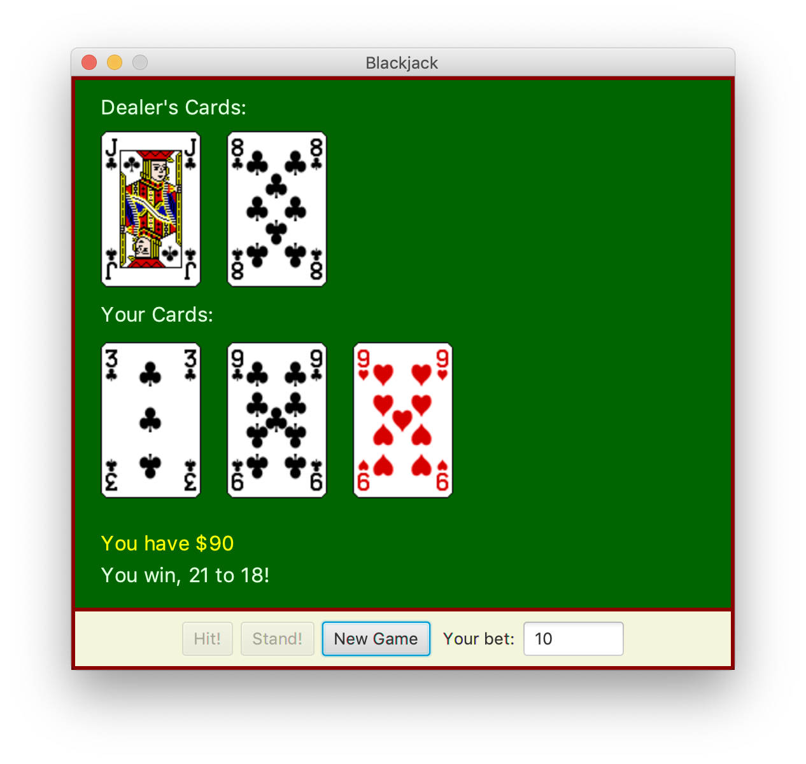

*到目前为止，还没有仔细阅读完ex6-ex11，仅仅运行了一遍代码，因为涉及到了游戏的规则还没有仔细看

#### Quiz
1. GUI(Graphical User Interface).
2. A programmer can set up any desired response to an event by writing an event-handling routine for that event.
3. A scene graph is a hierarchical data structure that represents the contents of a window.
4. Draw the picture

    ```java
    GraphicsContext g = canvas.getGraphicsContext2D();
g.setPaint(Color.RED);      // draw the shapes
g.fillOval(10,10,80,80);
g.setPaint()Color.GREEN);
g.fillRect(30,30,40,40);
    ```

6. MouseEvent 可以获取鼠标信息，包括位置、drag or click，在ecercise中使用到了`evt.isShiftDown()`
