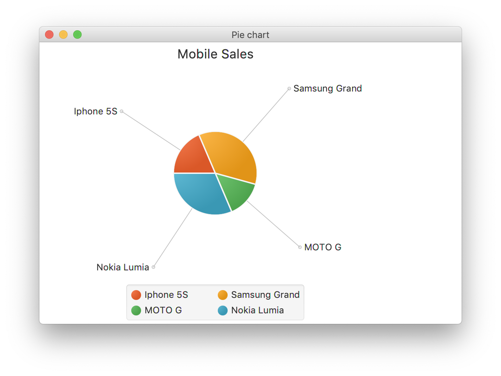

### Java2 - Data Visualization with JavaFX Document
**11510365 Yiheng Xue**
==Total = 4.5h==

#### 1. PieChart
At first, run the example code and get the pie chart as below

建立一个piechart的流程如下
1. Preparing the list object
    在这里输入数据，建立图表的list
2. Creating a pie chart
3. Setting the title
    这里是图表的title，不是窗口的title，这里的title是Mobile Sales
4. Setting the direction to arrange the data

    ```java
    pieChart.setClockwise(true);
    ```
    设置旋转方向，clockwise是ture还是false，和初始的进行对比，改成false的结果如下所示
        
5. Setting the length of the label line
    标签连接线的长度，改成100后是如下所示
    
6. Setting the labels of the pie chart visible
    True or False to setting whether the label can be shown.
7. Setting the start angle
8. Creating a group object
    
    ```java
    Group root = new Group(pieChart);
    ```
    
9. Creating a scene object
    
    ```java
    Scene scene = new Scene(root, 600, 400);
    ```
    
10. Setting title to the stage
    
    The title here is `Pie chart`
    
11. Adding scene to the stage
    
    ```java
    stage.setScene(scene);
    ```
    
12. Displaying the stage


#### 2. LineChart
Run the example code and the result shown as below

1. Defining the x axis

    ```java
NumberAxis xAxis = new NumberAxis(1960, 2020, 10); 
xAxis.setLabel("Years"); 
```
 
2. Defining the y axis

    ```java
NumberAxis yAxis = new NumberAxis(0, 350, 50); 
yAxis.setLabel("No.of schools"); 
    ```
    
3. Creating the line chart

    ```java
    LineChart linechart = new LineChart(xAxis, yAxis);  
    ```
    
4. Prepare series objects by setting data
5. Setting the data to line chart
6. Creating a group object
7. Creating a scene object
8. Setting title to the Stage
9. Adding scene to the stage
10. Displaying the contents of the stages


#### 3. AreaChart
The result is

对于两组相同维度的数据进行比较。

#### 4. BarChart
The result is

和之前的相比，在建立的时候改成`BarChart`，准备数据的时候有不一样之外，其他都差不多格式。
```java
XYChart.Series<String, Number> series1 = new XYChart.Series<>();
series1.setName("Fiat");
series1.getData().add(new XYChart.Data<>("Speed", 1.0));
series1.getData().add(new XYChart.Data<>("User rating", 3.0));
series1.getData().add(new XYChart.Data<>("Milage", 5.0));
series1.getData().add(new XYChart.Data<>("Safety", 5.0));
        
XYChart.Series<String, Number> series2 = new XYChart.Series<>();
series2.setName("Audi");
series2.getData().add(new XYChart.Data<>("Speed", 5.0));
series2.getData().add(new XYChart.Data<>("User rating", 6.0));
series2.getData().add(new XYChart.Data<>("Milage", 10.0));
series2.getData().add(new XYChart.Data<>("Safety", 4.0));

XYChart.Series<String, Number> series3 = new XYChart.Series<>();
series3.setName("Ford");
series3.getData().add(new XYChart.Data<>("Speed", 4.0));
series3.getData().add(new XYChart.Data<>("User rating", 2.0));
series3.getData().add(new XYChart.Data<>("Milage", 3.0));
series3.getData().add(new XYChart.Data<>("Safety", 6.0));
```


#### 5. BubbleChart
```java
import javafx.scene.chart.BubbleChart; 
```
The result is


#### 6. ScatterChart


#### 7. StackedAreaChart


#### 8. StackedBarChart


#### 9. CSS

1. Creating label email is `Email`, type is text.
2. Creating label password is `Password`
3. Creating text filed for email
4. Creating text filed for password
5. Creating button1 `Submit` and button2 `Clear`
6. Creating a grid pane
7. Setting size for the pane
8. Setting the padding
9. Setting the vertical and horizontal gaps between the columns
10. Setting the grid alignment
11. Arranging all the nodes in the grid
12. Styling nodes
13. Creating a scene object
14. Setting title to the stage
15. Adding scene to the stage
16. Displaying the contents of the stage

#### 10. Fit

