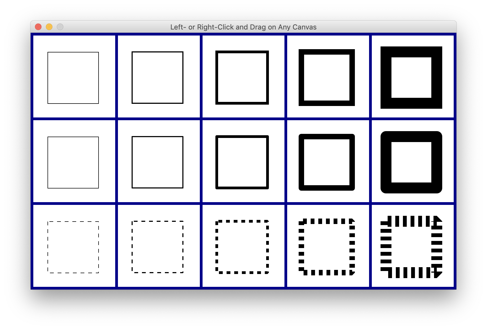

### Java2 - GUI Programming Continued
**11510365 Yiheng Xue**
==Total = 10h==

#### 1. Properties and Bindings
Run the `BoundPropertyDemo.java`, the result as below.

There are 2 different colors we could choose as background. 通过一个按键实现的，如果颜色很多的话可以通过menu里面的list来实现
```java
Background whiteBG = new Background(new BackgroundFill(Color.WHITE, null, null));
Background colorBG = new Background(new BackgroundFill(Color.PINK, null, null));

CheckBox bgCheck = new CheckBox("Use pink background");
message.backgroundProperty().bind( 
                new When(bgCheck.selectedProperty()).then(colorBG).otherwise(whiteBG));
```
This is a checkbox, the value of the box could change the background we have defined before.   
        

#### 2. Fancier Graphics
Run the `StrokeDemo.java`, the result as below.

There are 2 different types of painter. The first use the left click and drag, we can get a rectangle, and use the right click and drag could get a line. There are 3*5 different results. 每一行的线条形状不同，每一列的线条粗细不同。在`Display`中可以进行设置。
>In a graphics context, g, the cap style for strokes is set by calling g.setLineCap(cap). The parameter is of type StrokeLineCap, an enumerated type in package javafx.scene.shape whose possible values are StrokeLineCap.BUTT, StrokeLineCap.ROUND, and StrokeLineCap.SQUARE. The default style is SQUARE.


`PaintDemo.java` result shown as below

```java
patternPaint = new ImagePattern( pict, x, y, width, height, proportional );

patternPaint = new ImagePattern( pict, 0, 0, 1, 1, true );

patternPaint = new ImagePattern( pict, 0, 0, 0.25, 0.5, true );
```
The parameters are double except the last one. The constructor for a linear gradient paint takes the form

```java
linearGradient = new LinearGradient( x1,y1, x2,y2, proportional, cycleMethod,stop1, stop2, . . . );
grad = new LinearGradient( 120,120, 200,180, false, CycleMethod.MIRROR, new Stop( 0,   Color.color(1, 0.3, 0.3) ),  new Stop( 0.5, Color.color(0.3, 0.3, 1) ),  new Stop( 1,   Color.color(1, 1, 0.3)   )  );
```

`TransformDemo.java` show as below

>Changes to a coordinate system are referred to as transforms (or "transformations"). There are three basic types of transform. A translate transform changes the position of the origin, (0,0). A scale transform changes the scale, that is, the unit of distance. And a rotation transform applies a rotation about some point. Less common is a shear transform, which "tilts" an image. This illustration shows an original picture and several transformed copies of the picture:

Several transformed copies of the picture

`ToolPaint.java`

除了画笔之外，还有erase和smudge两种模式，分别是擦除和擦过模糊效果。
```java
PixelWriter pixWriter = g.getPixelWriter();
pixWriter.setColor( x, y, color );
WritableImage nodePic = node.snapshot(null,null);

pixels = new WritableImage(9,9);        // a 9-by-9 writable image
pixelReader = pixels.getPixelReader();  // a PixelReader for the writable image
snapshotParams = new SnapshotParameters();
```
menu中有save选项，通过io buffer的方式存储图片
```java
private void doSaveImage() {
    FileChooser fileDialog = new FileChooser(); 
    fileDialog.setInitialFileName("imagefile.png");
    fileDialog.setInitialDirectory(
                     new File( System.getProperty("user.home") ) );
    fileDialog.setTitle("Select File to Save. Name MUST end with .png!");
    File selectedFile = fileDialog.showSaveDialog(window);
    if ( selectedFile == null )
        return;  // User did not select a file.
    try {
        Image canvasImage = canvas.snapshot(null,null);
        BufferedImage image = SwingFXUtils.fromFXImage(canvasImage,null);
        String filename = selectedFile.getName().toLowerCase();
        if ( ! filename.endsWith(".png")) {
            throw new Exception("The file name must end with \".png\".");
        }
        boolean hasFormat = ImageIO.write(image,"PNG",selectedFile);
        if ( ! hasFormat ) { // (this should never happen)
            throw new Exception( "PNG format not available.");
        }
    }
    catch (Exception e) {
        Alert errorAlert = new Alert(Alert.AlertType.ERROR,
               "Sorry, an error occurred while\ntrying to save the image:\n"
                     + e.getMessage());
        errorAlert.showAndWait();
    }    
}
```

#### 3. Complex Components and MVC
`TestStopWatch.java` 

`SillyStamper.java`

`EditListDemo.java`

`SampleTableDemo.png`

`ScatterPlotTableDemo.java`

#### 4. Mostly Windows and Dialogs
`TestDialogs.java`

`WebBrowser.java`

#### 5. Finishing Touches
`Mandel.file`

这里包括的主图展示, Menus, SetImageSize, SetLimitsDialog等多个方法，菜单类似于javafx练习中的模型。


#### Exercise
##### Exercise1

Fill the overlay canvas with a random color as below
```java
overlayGraphics.setFill( Color.hsb(360*Math.random(), 0.5, 0.5) );
overlayGraphics.fillRect( 0,0, width,height );
picGraphics.drawImage( pictures.get(nextPicIndex), 0,0, width,height );
```

##### Exercise2


在之前的基础上添加了一个当前计时的界面。
##### Exercise3

完善了之前的menu界面，增加了可以设置的选项。
##### Exercise4

For the file that stores the phone book data, I used the simple data format from the original program. That program already had code for loading and saving the data, at the beginning and end of its main() routine. I copied that code into two instance methods named loadPhoneBook() and savePhoneBook(), and I modified the code to use data stored in an ObservableList instead of in a Map. The savePhoneBook() method is called by an event handler when the window is closed, as suggested in the exercise:
```java
stage.setOnHidden( e -> savePhoneBook(dataFile, phoneEntries) );
```

#### Quiz
1. `Observable value` is an object that emits events when its value is changed. `Observable property` is a property in an object that is an observable value.
2. The handler for that event can set the text in the label
    ```java
    input.textProperty().addListener( e -> label.setText(input.getText()) );
    ```
    Another option is to bind that property to the property of the input box
    ```java
    label.textProperty().bind( input.textProperty() );
    ```
    The handler for a ChangeEvent takes three parameters, where the third parameter is the new value of the observable property, so the task could also be accomplished by
    ```java
    input.textProperty().addListener( (o,oldVal,newVal) -> label.setText(newVal)) );
    ```
    
1. The picture is 100*100 pixels, and rotate 30 degrees, the blank color is filled by red, translate half of width and height.
2. `g.save()`pushes a copy of the current state of the graphics context onto a stack of saved states. `g.restore()` will pop the most recently saved state from the stack and restore graphics context properties to their values from that state. Any changes to the state that were made after the corresponding call to `g.save()` will be undone. This allows you to change make temporary changes to the state while being sure that those changes will not carry over to future drawing.
3. MVC is Model-View-Controller. In a list, the view is the actual visible component on the screen.
4. Internationalization refers to writing the program in a way that will make it easy to adapt the program for use in a variety of 'locales'.