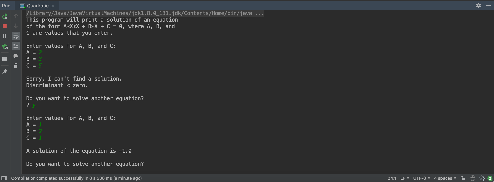
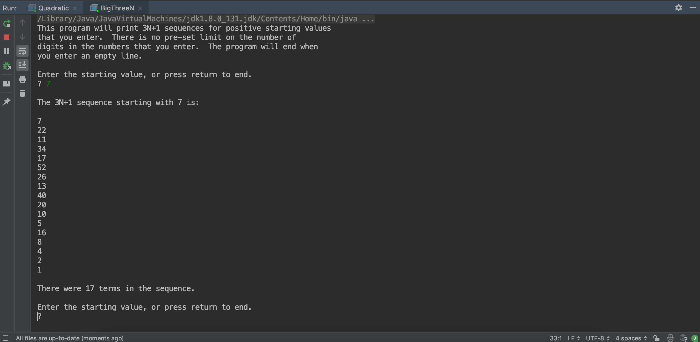
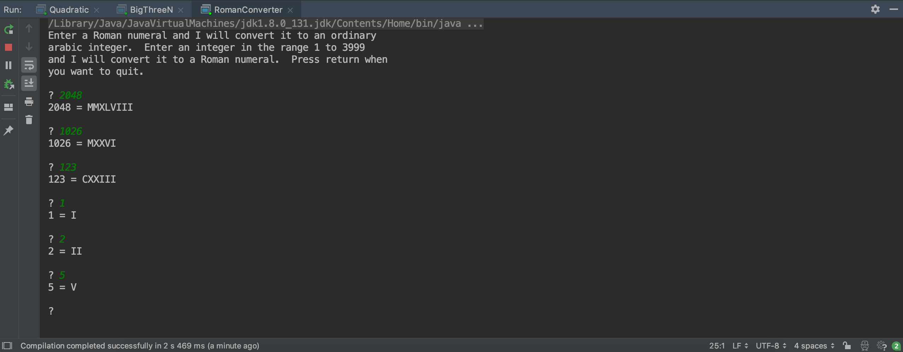
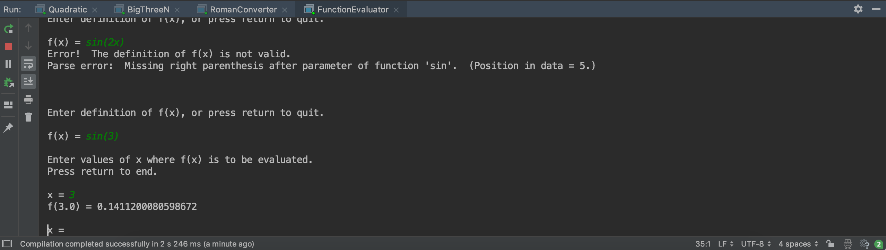
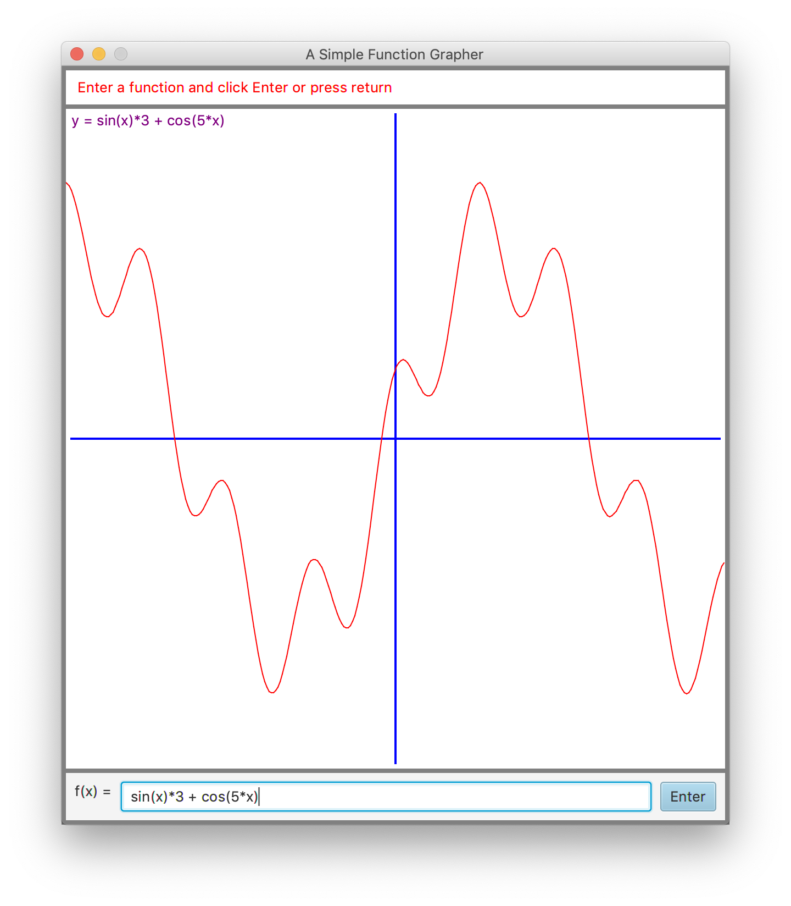

### Java2 - JavaFX Document
**11510365 Yiheng Xue**
==Total = 6.5h==

#### Exercise

##### Exercise1. 
The root() subroutine must be called in a try...catch statement as below
```java
try {
   solution = root(A,B,C);
   System.out.println("A solution of the equation is " + solution);
}
catch (IllegalArgumentException e) {
   System.out.println("Sorry, I can't find a solution.");
   System.out.println(e.getMessage());
}
```
And get the input to compute
```java
static public double root( double A, double B, double C ) 
                                throws IllegalArgumentException {
    if (A == 0) {
        throw new IllegalArgumentException("A can't be zero.");
    }
    else {
        double disc = B*B - 4*A*C;
        if (disc < 0)
            throw new IllegalArgumentException("Discriminant < zero.");
        return  (-B + Math.sqrt(disc)) / (2*A);
    }
} 
```

   
##### Exercise2.
Defines TWO as a constant, along with server other BigIntegers that represent values that I need:
```java
static final BigInteger THREE = new BigInteger("3");
static final BigInteger ONE = new BigInteger("1");
static final BigInteger TWO = new BigInteger("2");
```
With these constants, the code for computing the next term in a 3N+1 sequence becomes:
```java
if (N.testBit(0) == false) {
        // N is even.  Divide N by 2.
    N = N.divide(TWO);
}
else {
        // N is odd.  Multiply N by 3, then add 1.
    N = N.multiply(THREE);
    N = N.add(ONE);
}
```

##### Exercise3.
The algorithm for converting a String, roman, to an int, arabic as below
```java
Let arabic = 0
Let i = 0  // representing a position in the string

while i is a legal position in the string:
    Let ch be the character in position i
    Let N be the numeric equivalent of ch
    i++   // to account for the character, ch
    if there are no additional characters in the string:
          // (We need to make this test first, to avoid an error
          // when we try to look at the next character.)
       Add N to arabic
    else:   // Try pairing the ch with the next character
       Let N2 be the numeric equivalent of the NEXT character
       If N < N2:  // Evaluate the characters as a pair
           Add (N2 - N) to arabic
           i++    // to account for the extra character
       else:
           Add N to arabic
```
This algorithm does not take into account that the string might not be a legal Roman numeral.
We should consider the loop as below
```java
while (N >= 1000) {
   roman += "M";
   N -= 1000;
}
```
All the 1000's in N have been converted to M's in roman, and we can be sure that N is 999 or less.

##### Exercise4.
The algorithm for reading and processing the user's numbers becomes
```java
while (true):
    Get a line of input from the user
    if the line is empty:
       break
    try {
       Let x = Double.parseDouble(line)
    }
    catch (NumberFormatException e) {
       Print an error message
       continue
    }
    Let val = expression.value(x)
    if val is Double.NaN:
       Print an error message
    else:
       Output val
```

##### Exercise5.
The algorithm for the drawFunction() method is as below
```java
Let dx = 10.0 / 300;
Let x = -5                // Get the first point
Let y = func.value(x)
for i = 1 to 300:
    Let prevx = x         // Save the previous point
    Let prevy = y
    Let x = x + dx        // Get the next point
    Let y = func.value(x)
    if neither y nor prevy is Double.NaN:
       draw a line segment from (prevx,prevy) to (x,y)
```


#### Quiz & Notes
1. When variables must be declared, the unintentional creation of a variable is simply impossible, and a whole class of possible bugs is avoided.
2. A precondition is a condition that has to hold at a given point in the execution of a program, if the execution of the program is to continue correctly. Also, a precondition of a subroutine is a condition that has to be true when the subroutine is called in order for the subroutine to work correctly.
3. In order to have a correct and robust program, the programmer must deal with the possible error. There are several approaches that the programmer can take.
4. Print out a `3N+1` sequence
    ```java
        static void printThreeNSequence(int N) {
   
    assert  N > 0 : "Starting value for 3N+1 sequence must be > 0.";

    System.out.println("3N+1 sequence starting from " + N + " is: ");
   
    System.out.println(N);
    while (N > 1) {
        if (N % 2 == 0) {  // N is even.  Divide by 2.
            N = N / 2;
        }
        else {  // N is odd.  Multiply by 3 and add 1.
            assert  N <= 2147483646/3 : "Value has exceeded the largest int.";
            N = 3 * N + 1;
        }
        System.out.println(N);
    }
   
    }
    ```
1. `try...catch` statement
    ```java
    try {
    processData();
    }
    catch (IOException e) {
    System.out.println("An IOException occurred while processing the data.");
    }
    ```
